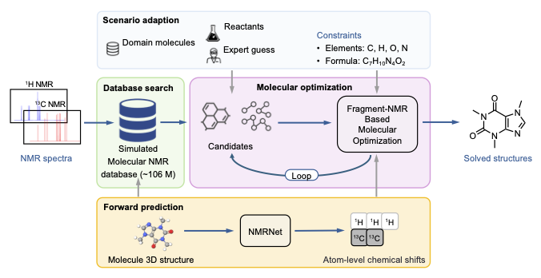
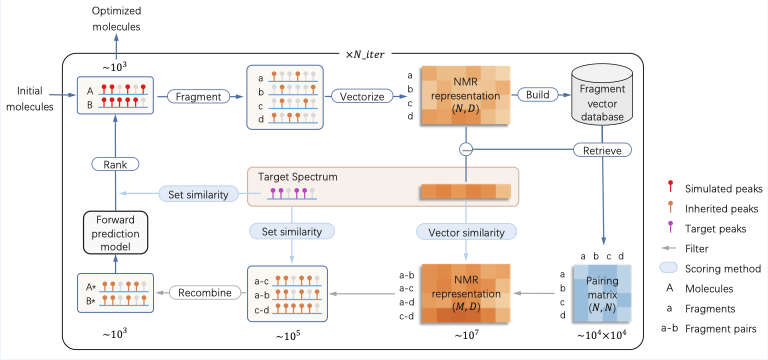

# Official implementation of **NMR-Solver**

<!-- [](https://github.com/YongqiJin/NMR-Solver) -->
[](https://arxiv.org/abs/2509.00640)
[](https://huggingface.co/datasets/yqj01/SimNMR-PubChem)
[](https://doi.org/10.5281/zenodo.16952024)
[](https://www.bohrium.com/apps/nmr-toolbox)
<!-- <a href="https://bohrium.com" style="position:relative; display:inline-block;">
  
  
</a> -->


# NMR-Solver: Automated Structure Elucidation via Large-Scale Spectra Matching and Physics-Guided Fragment Optimization

## Overview

This project integrates large-scale spectral matching with physics-guided fragment optimization, providing a powerful framework for automated molecular structure elucidation from <sup>1</sup>H and <sup>13</sup>C NMR spectra.




## Online App

For the most seamless experience, try our web-based application directly without any installation:

🚀 **[Try NMR-Toolbox on Bohrium](https://www.bohrium.com/apps/nmr-toolbox)**

Hosted on the Bohrium platform, NMR-Toolbox offers an intuitive interface for:
- **NMR Database Search**
- **Structure Elucidation from NMR**
- **Chemical Shift Prediction & Spectral Matching**


## Setup

### SimNMR-PubChem Database

The processed dataset (373 GB) and database index (128 GB) for the SimNMR-PubChem Database are available on [Hugging Face](https://huggingface.co/datasets/yqj01/SimNMR-PubChem). Please place them in the [database](database) directory.

### Models & Datasets

Pre-trained model weights and evaluation datasets can be downloaded on [Zenodo](https://doi.org/10.5281/zenodo.16952024). Please place them in the [model](model) and [data](data) directories respectively.

### Docker

You can use our pre-built Docker image for easy setup and deployment:

```bash
# Pull the latest Docker image
docker pull yqjin/nmr_solver:0.0.1

# Run the container interactively
docker run -it --rm yqjin/nmr_solver:0.0.1

# Or run with volume mounting for your data
docker run -it --rm -v /path/to/your/data:/workspace/data yqjin/nmr_solver:0.0.1
```

This Docker image includes all necessary dependencies and a pre-configured environment for running NMR-Solver.

## Usage

### Deploy Database

To deploy the SimNMR-PubChem Database, run the following command:

```bash
python src/faiss_server/server.py
```

Then update the server configuration in [config.yaml](src/faiss_server/config.yaml) to point to your server address.

### Run Demo

Modify the configuration file `config/demo.yaml` as needed.

To run the algorithm, use the following command:

```bash
sh scripts/run.sh demo
```

For evaluation, use:

```bash
sh scripts/eval.sh demo
```

## Contact Us

1. **GitHub Issues**  
   For bug reports, feature requests, or technical questions, please open an issue on our [GitHub repository](https://github.com/YongqiJin/NMR-Solver).

2. **WeChat**  
   Join our WeChat user community to discuss NMR-Solver with other users and developers. Scan the QR code below to join our group:

<div align="center">

</div>

3. **E-mail**  
   For collaboration inquiries, commercial licensing, or in-depth communication with our development team, please contact us at: [jinyongqi@dp.tech](mailto:jinyongqi@dp.tech)

## Citation

Please kindly cite our paper if you use this codebase:

```bibtex
@article{jin2025nmrsolver,
  title={NMR-Solver: Automated Structure Elucidation via Large-Scale Spectral Matching and Physics-Guided Fragment Optimization},
  author={Jin, Yongqi and Wang, Jun-Jie and Xu, Fanjie and Ji, Xiaohong and Gao, Zhifeng and Zhang, Linfeng and Ke, Guolin and Zhu, Rong and E, Weinan},
  year={2025},
  journal={arXiv preprint arXiv:2509.00640}
}
```

## License

This project is licensed under the MIT License. See [LICENSE](LICENSE) for additional details.
