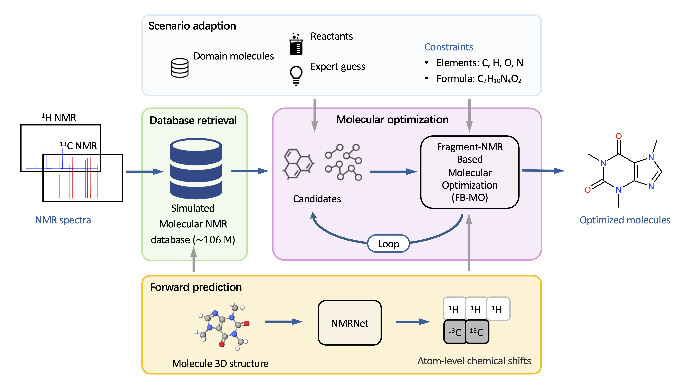
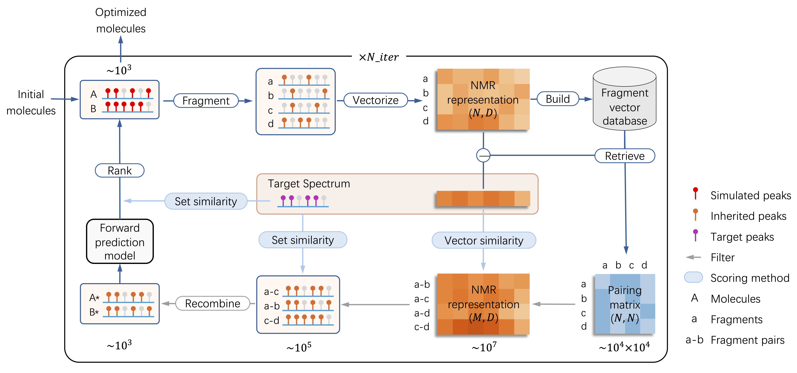

# NMR-Solver: Automated Structure Elucidation via Large-Scale Spectral Matching and Physics-Guided Fragment Optimization

[](https://arxiv.org/abs/2509.00640)
[](https://www.nature.com/articles/s41467-026-71315-0)
[](https://huggingface.co/datasets/yqj01/SimNMR-PubChem)
[](https://doi.org/10.5281/zenodo.16952024)
[](https://www.bohrium.com/apps/nmr-toolbox)

## Overview

This project integrates large-scale spectral matching with physics-guided fragment optimization, providing a powerful framework for automated molecular structure elucidation from <sup>1</sup>H and <sup>13</sup>C NMR spectra.




## Publication & Related Work

NMR-Solver has been formally published in [Nature Communications](https://www.nature.com/articles/s41467-026-71315-0):

- **[2026-04] [NMR-Solver: automated structure elucidation via large-scale spectral matching and physics-guided fragment optimization](https://www.nature.com/articles/s41467-026-71315-0)**  
  A practical and interpretable framework for automated small-molecule structure elucidation from <sup>1</sup>H and <sup>13</sup>C NMR spectra.

Related team work:

- **[2026-01] NMRNet++. [From Human Labels to Literature: Semi-Supervised Learning of NMR Chemical Shifts at Scale](https://github.com/YongqiJin/NMRNetplusplus)**  
  A chemical shift prediction model trained with large-scale unassigned NMR data, solvent information, and support for multiple heteroatoms.
- **[2025-12] [NMRexp: A database of 3.3 million experimental NMR spectra](https://www.nature.com/articles/s41597-025-06245-5)**  
  A large-scale literature-derived experimental NMR database covering 3.3 million spectra across multiple nuclei.
- **[2025-03] NMRNet. [Toward a unified benchmark and framework for deep learning-based prediction of nuclear magnetic resonance chemical shifts](https://www.nature.com/articles/s43588-025-00783-z)**  
  A unified benchmark and NMRNet framework for deep learning-based chemical shift prediction.

## Online App

For the most seamless experience, try our web-based application directly without any installation:

🚀 **[Try NMR-Toolbox on Bohrium](https://www.bohrium.com/apps/nmr-toolbox)**

Hosted on the Bohrium platform, NMR-Toolbox offers an intuitive interface for:
- **NMR Database Search**
- **Structure Elucidation from NMR**
- **Chemical Shift Prediction & Spectral Matching**


## Setup

### SimNMR-PubChem Database

The processed dataset (373 GB) and database index (128 GB) for the SimNMR-PubChem Database are available on [Hugging Face](https://huggingface.co/datasets/yqj01/SimNMR-PubChem). Please place them in the [database](database) directory.

### Models & Datasets

Pre-trained model weights and evaluation datasets can be downloaded on [Zenodo](https://doi.org/10.5281/zenodo.16952024). Please place them in the [model](model) and [data](data) directories respectively.

### Environment

Two installation options are available: **source install** and **Docker**.

#### 1. Source Install

```bash
conda create -n nmr-solver -y python=3.10
conda activate nmr-solver
pip install torch==2.5.1 --index-url https://download.pytorch.org/whl/cu121
pip install --no-build-isolation -r requirements.txt
```

#### 2. Docker

```bash
# Pull the latest Docker image
docker pull yqjin/nmr_solver:0.0.1

# Run the container interactively
docker run -it --rm yqjin/nmr_solver:0.0.1

# Or run with volume mounting for your data
docker run -it --rm -v /path/to/your/data:/workspace/data yqjin/nmr_solver:0.0.1
```

This Docker image includes all necessary dependencies and a pre-configured environment for running NMR-Solver.

## Usage

### Deploy Database

To deploy the SimNMR-PubChem Database, run the following command:

```bash
python src/faiss_server/server.py
```

Then update the server configuration in [config.yaml](src/faiss_server/config.yaml) to point to your server address.

### Run Demo

Modify the configuration file `config/demo.yaml` as needed.

To run the algorithm, use the following command:

```bash
sh scripts/run.sh demo
```

For evaluation, use:

```bash
sh scripts/eval.sh demo
```

## Contact Us

1. **GitHub Issues**  
   For bug reports, feature requests, or technical questions, please open an issue on our [GitHub repository](https://github.com/YongqiJin/NMR-Solver).

2. **E-mail**  
   For collaboration inquiries, commercial licensing, or in-depth communication with our development team, please contact us at: [jinyongqi@dp.tech](mailto:jinyongqi@dp.tech)

## Citation

Please kindly cite our paper if you use this codebase:

```bibtex
@article{jin2026nmrsolver,
  title={NMR-Solver: Automated Structure Elucidation via Large-Scale Spectral Matching and Physics-Guided Fragment Optimization},
  author={Jin, Yongqi and Wang, Jun-Jie and Xu, Fanjie and Ji, Xiaohong and Gao, Zhifeng and Zhang, Linfeng and Ke, Guolin and Zhu, Rong and E, weinan},
  journal={Nature Communications},
  year={2026},
  doi={10.1038/s41467-026-71315-0},
  url={https://doi.org/10.1038/s41467-026-71315-0}
}
```

## License

This project is licensed under the MIT License. See [LICENSE](LICENSE) for additional details.
